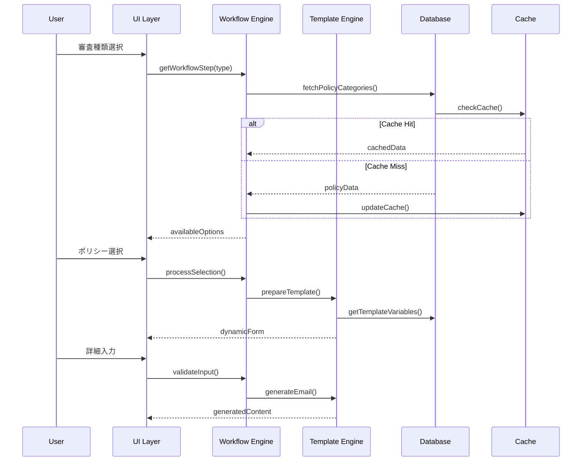

# PolicyPlayBook システムアーキテクチャ仕様書

## 1. システム概要

### 1.1 目的
Google広告ポリシー違反に関する対応メールを、ワークフローベースで効率的に生成するシステム

### 1.2 主要機能
- ワークフロー駆動型メール生成
- 動的テンプレート処理
- スプレッドシートベースのデータ管理
- リアルタイム入力検証
- 多段階承認プロセス

## 2. アーキテクチャ設計

### 2.1 レイヤー構造

```
┌─────────────────────────────────────────┐
│         Presentation Layer              │
│   (HTML/CSS/JavaScript - Client Side)   │
├─────────────────────────────────────────┤
│         Application Layer               │
│   (Google Apps Script - Server Side)    │
├─────────────────────────────────────────┤
│          Business Logic Layer           │
│   (Workflow Engine / Template Engine)   │
├─────────────────────────────────────────┤
│           Data Access Layer             │
│      (Spreadsheet API / Cache)          │
├─────────────────────────────────────────┤
│            Data Storage Layer           │
│         (Google Sheets Database)        │
└─────────────────────────────────────────┘
```

### 2.2 コンポーネント設計

#### 2.2.1 フロントエンド
- **UI Controller**: ユーザーインタラクション管理
- **Form Manager**: 動的フォーム生成・検証
- **Workflow Navigator**: ステップ遷移制御
- **Template Preview**: リアルタイムプレビュー

#### 2.2.2 バックエンド
- **Workflow Engine**: ビジネスロジック実行
- **Template Processor**: 変数置換・条件分岐処理
- **Database Service**: CRUD操作
- **Cache Manager**: パフォーマンス最適化
- **Validation Service**: データ整合性保証

## 3. データフロー

### 3.1 メイン処理フロー



## 4. ワークフローステート管理

### 4.1 ステート定義

```javascript
const WorkflowStates = {
    INITIAL: 'initial',
    TYPE_SELECTED: 'type_selected',
    POLICY_SELECTED: 'policy_selected',
    STATUS_SELECTED: 'status_selected',
    INPUT_REQUIRED: 'input_required',
    VALIDATION: 'validation',
    GENERATION: 'generation',
    COMPLETED: 'completed',
    ERROR: 'error'
};
```

### 4.2 状態遷移ルール

| 現在の状態 | アクション | 次の状態 | 条件 |
|-----------|----------|---------|------|
| INITIAL | selectType | TYPE_SELECTED | type != null |
| TYPE_SELECTED | selectPolicy | POLICY_SELECTED | policy != null |
| POLICY_SELECTED | selectStatus | STATUS_SELECTED | status != null |
| STATUS_SELECTED | requireInput | INPUT_REQUIRED | hasRequiredFields |
| STATUS_SELECTED | generate | GENERATION | !hasRequiredFields |
| INPUT_REQUIRED | submitInput | VALIDATION | allFieldsFilled |
| VALIDATION | validate | GENERATION | validationPassed |
| GENERATION | complete | COMPLETED | success |
| ANY | error | ERROR | exception |

## 5. データモデル

### 5.1 エンティティ関係図

```
Templates (1) ---- (*) Variables
    |                    |
    |                    |
    +---- (*) Categories |
                         |
                    (*) Options
```

### 5.2 主要エンティティ

#### Template
- template_id (PK)
- category
- subcategory
- template_name
- template_content
- required_variables (JSON)
- optional_variables (JSON)
- is_active
- workflow_config (JSON)

#### Variable
- variable_name (PK)
- display_name
- variable_type
- validation_rule
- default_value
- options_source
- dependencies (JSON)

#### Option
- option_id (PK)
- variable_name (FK)
- option_value
- option_label
- condition (JSON)
- sort_order

## 6. セキュリティ設計

### 6.1 認証・認可
- Google OAuth 2.0
- セッション管理
- ロールベースアクセス制御

### 6.2 データ保護
- 入力サニタイゼーション
- XSS対策
- SQLインジェクション防止
- 監査ログ

## 7. パフォーマンス最適化

### 7.1 キャッシュ戦略
- メモリキャッシュ (PropertiesService)
- スプレッドシートキャッシュ
- クライアントサイドキャッシュ

### 7.2 最適化指標
- 初期ロード: < 3秒
- API応答: < 1秒
- テンプレート生成: < 2秒

## 8. エラーハンドリング

### 8.1 エラータイプ
- ValidationError: 入力検証エラー
- WorkflowError: ワークフロー制御エラー
- TemplateError: テンプレート処理エラー
- DatabaseError: データアクセスエラー
- NetworkError: 通信エラー

### 8.2 リカバリー戦略
- 自動リトライ (最大3回)
- フォールバック処理
- ユーザー通知
- エラーログ記録

## 9. 拡張性考慮事項

### 9.1 プラグインアーキテクチャ
- カスタムバリデーター
- カスタムテンプレート関数
- 外部API連携

### 9.2 スケーラビリティ
- 水平分散対応
- 非同期処理
- バッチ処理対応